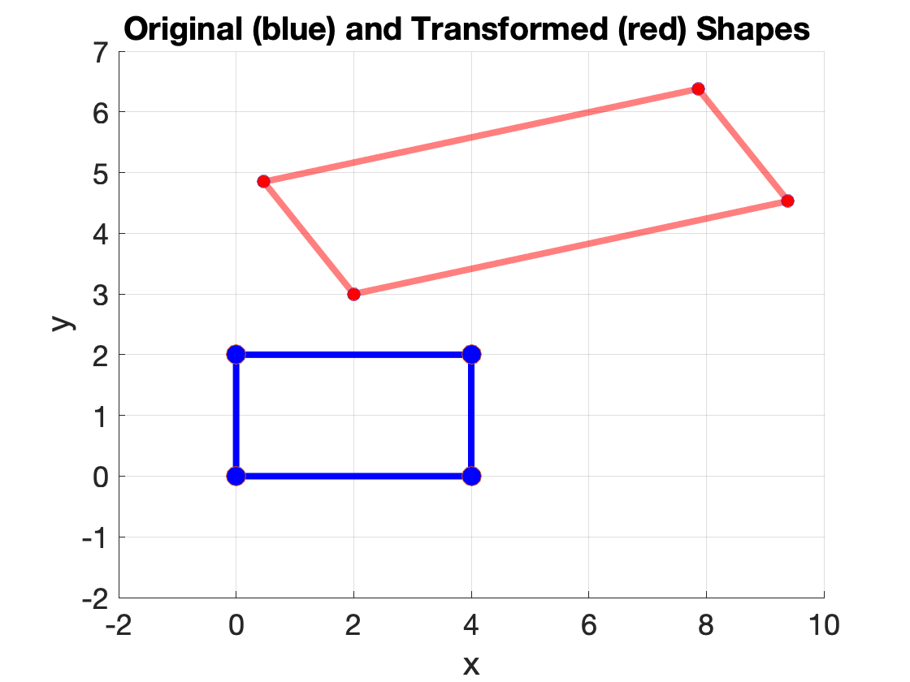

# Affine Transformations

#### **Overview**

Affine transformations preserve straight lines and parallel lines. But they do to in general preserve angles and distances. In contrast with linear transformations,  an affine transformations does not preserve the origin. While a linear transformation keeps the transformed vectors "attached" to the origin, the affine transformation may "shift" or translate the location of transformed vectors. Affine transformations include linear transformations as a sub set.

#### **One-dimensional affine transformations** 

The function $f: \mathbb{R} \rightarrow \mathbb{R}$ such that
$$
\begin{align}
	f(x) = ax  + b
		\label{linear1D}
\end{align}
$$
with $a,b\in \R$ is a 1-D affine transformation. It maps (transforms) the value $x$ onto a new value $ax + b$. For example, $f\left(x\right) = 3x + 1$. Note that the affine transformation consists of a linear transformation (i.e., $ax$) followed by a translation (or shift) by a quantity $b$. 

#### **Two-dimensional linear transformations** 

The 2-D extension of the affine function in Equation $\ref{linear1D}$ transforms two-dimensional vectors ${\bf x} = (x,y)^\mathsf{T}$ onto two-dimensional vectors. In this case, we write $f: \mathbb{R}^2 \rightarrow \mathbb{R}^2$ such that:
$$
\begin{align}
		x^\prime = f_1\left(x,y\right) = a_1 x + a_2 y + t_x, \notag \\
		y^\prime = f_2\left(x,y\right) = a_3 x + a_4 y + t_y.
		\label{2Daffine}
\end{align}
$$

Equation $\ref{2Daffine}$ can be written in matrix form as:
$$
\begin{align}
		\begin{bmatrix}
		x^\prime \\
		y^\prime
	\end{bmatrix}	
 	=
	\begin{bmatrix}
		a_1 & a_2 \\
		a_3 & a_4
	\end{bmatrix}
	\begin{bmatrix}
		x \\
		y
	\end{bmatrix}	
+
	\begin{bmatrix}
		t_x \\
		t_y
	\end{bmatrix},
\end{align}
$$
or, in short:
$$
\begin{align}
	{\bf x}^\prime = A{\bf x} + {\bf b}.
	\label{linearND}
\end{align}
$$
The figure shows an example of an affine transformation applied to a rectangle shape.

Here, we can see a key difference in matrix notations between a linear transformation and an affine transformation, i.e., the affine transformation uses multiplication followed by an addition.  Its inverse transformation is given by: 
$$
\begin{align}
	{\bf x} = A^{-1}\left({\bf x}^\prime - {\bf b}\right).
	\label{affine3}
\end{align}
$$

#### **The translation component complicates the matrix notation** 

In comparison with linear transformations, the added (i.e., translation) term in the affine transformation complicates both the notation and algebraic manipulations when we compose multiple transformations. For example, the following composition applies a general affine transformation $A$ to vector ${\bf x}$ followed by a rotation $R$:
$$
\begin{align}
	{\bf x}^\prime = R\,\left(A\,{\bf x} + {\bf b}\right),
	\label{affineInverse}
\end{align}
$$
Equation $\ref{affine3}$ can be written as: 
$$
\begin{align}
	{\bf x}^\prime = R\,A\,{\bf x} + R\,{\bf b},
	\label{affine3exapanded}
\end{align}
$$
which has the following inverse transformation: 
$$
\begin{align}
	{\bf x} &= (R\,A)^{-1}\,{\bf x}^\prime - (R\,A)^{-1}\,R\,{\bf b} \notag \\
	&= (A^{-1}\,R^{-1})\,{\bf x}^\prime - (A^{-1}\,R^{-1})\,R\,{\bf b}\notag\\
		&= (A^{-1}\,R^{-1})\,{\bf x}^\prime - A^{-1}\,{\bf b}.
	\label{affine3inverse}
\end{align}
$$
The inclusion of the translation component ${\bf t}$ complicates the notation significantly when compared to compositions of linear transformations such as: 
$$
\begin{align}
	{\bf x}^\prime = R\,A\,{\bf x},
	\label{linearNDs}
\end{align}
$$
which has the following inverse:
$$
\begin{align}
	{\bf x} = \left(R\,A\right)^{-1}\,{\bf x}^\prime = A^{-1}R^{-1}\,{\bf x}^\prime.
	\label{linearInverse}
\end{align}
$$
We can make the matrix notation of affine transformations more concise by using *Homogeneous* coordinates (or projective coordinates) instead of Cartesian coordinates. This is done by augmenting the Cartesian coordinates with an extra non-zero coordinate value, which is usually chosen to be 1. We will talk more about homogenous coordinates later. 

